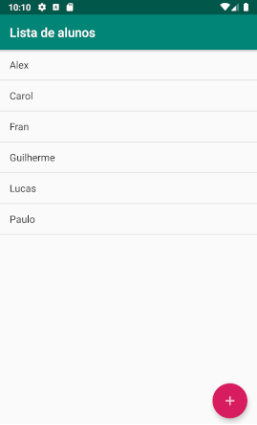
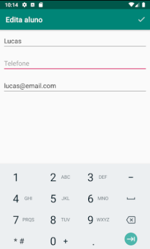

## Phone Book App Study

A very simple Phone Book model app developed in Portuguese that allows the user to save and edit student contacts containing 
their name, phone number and email adress.

  

### About the app

This app was developed during my studies in Java development for Android.
Since this is only for showcase, this app eventually will get improved as far as my java studies goes on. 

>**My goals with this project was to:**
>- Develop and improve Activity workflow and simple layouts.
>- Work with simple life cycle callbacks.
>- Work with DAO class in order to get acess to the app data source.

### App Functionality

* Add new contacts by clicking on the Add Button (Floating Action Button).
* After filling the blank text inputs, save by clicking into the Check button.
* Clicking into existing contacts allow the user to Edit the existing info.
* Long click on a contact allows the User to Remove contact by clicking into "Remover" (remove).

### How to Run

**Android Studio**

* Import the project in android studio;
* Go to Run > Run app;
* Select a device, or create a new one by following the wizard;
